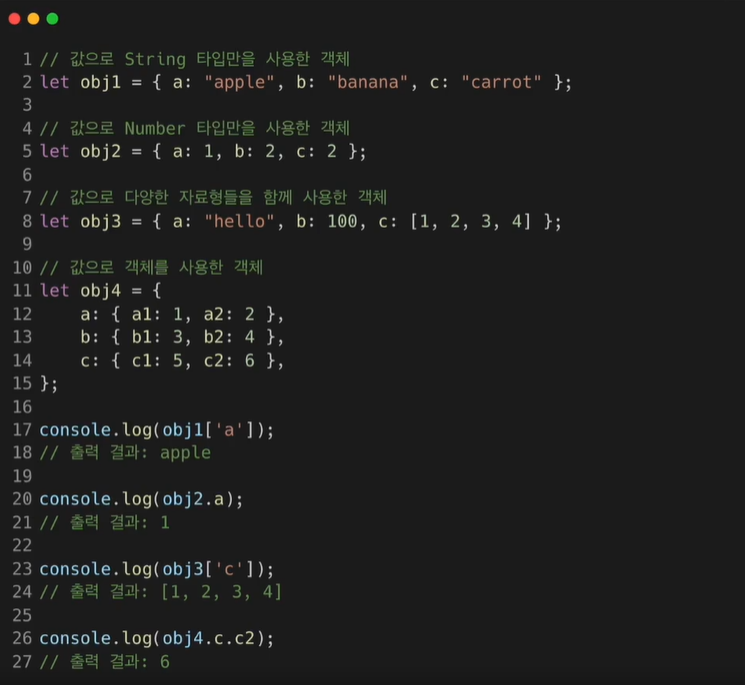
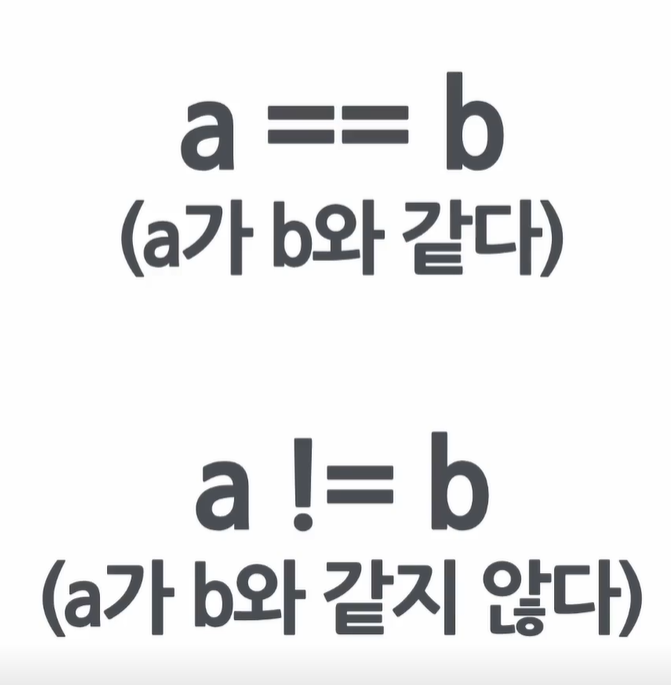

# SPA
### = Single Page Application
vs Multi Page Application
> 하나의 웹페이지 
> 안에 수많은 페이지들이 존재함
---

# JavaScript
### ECMAScript (ES5, ES6 ...)

> 스크립트 언어  
> 컴파일 언어와는 차이가 있다

ECMAScript 2015 = ES6

---

# 자료형
> 자료형은 동적 타이핑을 사용한다.  
> 변수를 선언할때 타입을 지정하는게 아닌, 변수가 삽입될때 타입이 지정된다.

### undefined vs null
> 정의를 하지 않음  
> 정의를 했으나 값이 null
> 
> 
> 



Object 타입 안의 데이터를 읽고자 할때는 []대괄호를 쓰고 안에 변수를 적던지, 아니면 .점을 찍고 변수를 적으면 된다.

```javascript
let a = 1;
let b = a++;
console.log(a, b);
```


# 일치연산자
> ## ===
a가 b와 값과 자료형이 모두 같다

React
사용자 인터페이스를 만들기 위한 자바스크립트 라이브러리.